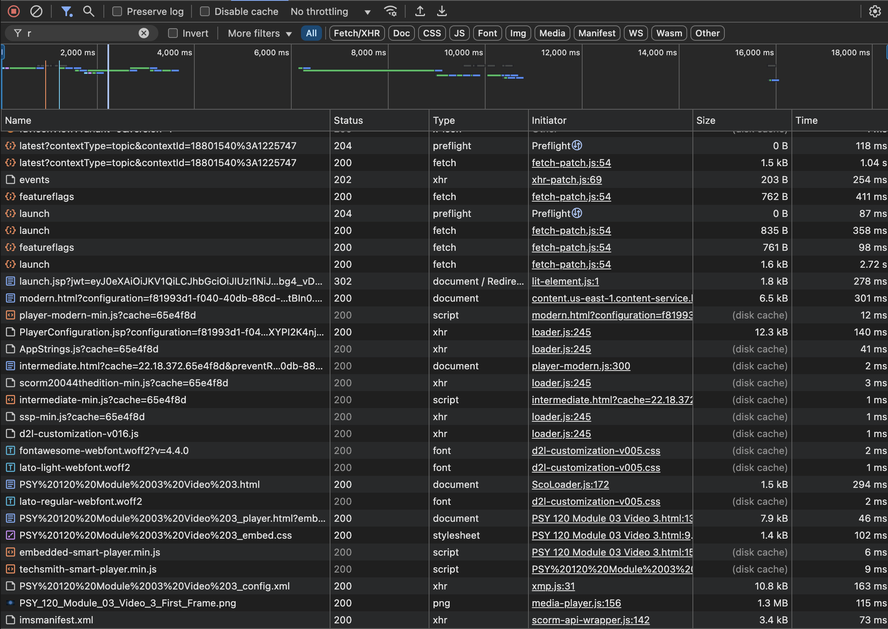
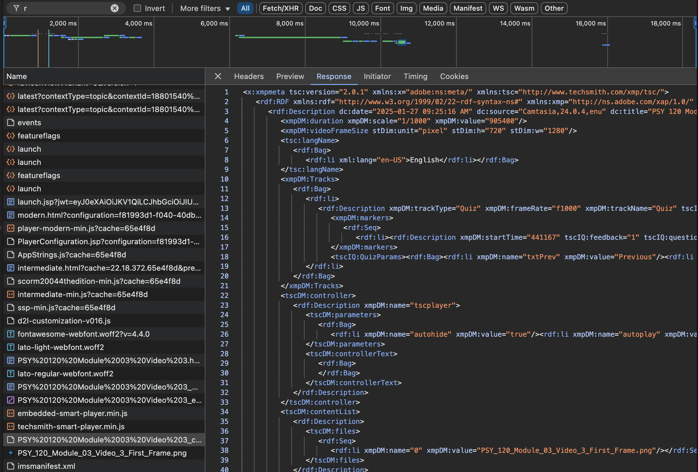
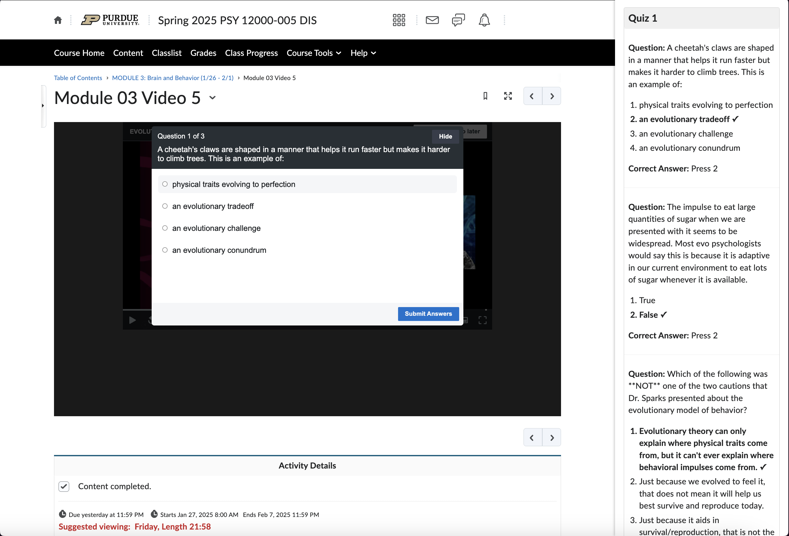

<p align="center">
  
</p>

<h1 align="center">Brightspace Video Answer Extractor</h1>

<p align="center">
  A Chrome extension that extracts quiz answers from Brightspace video content by intercepting and parsing Camtasia's XML configuration files. Part of the Purdue Automation Initiative.
</p>

<p align="center">
  <a href="#installation">Installation</a> •
  <a href="#how-it-works">How It Works</a> •
  <a href="#technical-details">Technical Details</a> •
  <a href="#development">Development</a> •
  <a href="#license">License</a>
</p>

## Overview

Brightspace Video Answer Extractor is a Chrome extension that helps students review video content more effectively by extracting and displaying embedded quiz answers from Brightspace videos. It works by intercepting the video configuration files and presenting the information in a convenient side panel.

## Installation

1. Download the latest release from the [releases page](link-to-releases)
2. Open Chrome and navigate to `chrome://extensions/`
3. Enable "Developer mode" in the top right
4. Click "Load unpacked" and select the extracted extension folder

## How It Works

### The Technical Process

1. **XML Configuration Discovery**

   - When a Brightspace video loads, it requests a configuration file from `content.us-east-1.content-service.brightspace.com`
   - These files follow the pattern `*_config.xml` and contain all quiz data

   <p align="center">
     
     <br>
     <em>Network requests showing XML configuration file being loaded</em>
   </p>

2. **Request Interception**

   - The extension uses Chrome's `webRequest` API to intercept these XML requests
   - When detected, it captures and stores the configuration data

   <p align="center">
     
     <br>
     <em>Example of intercepted XML configuration data</em>
   </p>

3. **Data Extraction**

   - The XML contains quiz data in Adobe XMP format with custom Camtasia namespaces
   - Questions, answers, and correct response indicators are parsed from:
     ```xml
     <tscIQ:questions>
       <rdf:Description tscIQ:type="MC">
         <tscIQ:question>...</tscIQ:question>
         <tscIQ:correctAnswer>...</tscIQ:correctAnswer>
         <tscIQ:answer>...</tscIQ:answer>
       </rdf:Description>
     </tscIQ:questions>
     ```

4. **Display**

   - Extracted data is shown in a side panel next to the video
   - Questions are grouped by quiz section
   - Correct answers are highlighted

   <p align="center">
     
     <br>
     <em>Extension displaying extracted answers alongside video content</em>
   </p>

## Technical Details

### Architecture

- **Background Script**: Monitors network requests for XML configuration files
- **Content Script**: Injects and manages the side panel UI
- **Popup**: Provides historical data access and debugging information

### Data Flow

1. `background.js` intercepts XML requests
2. Configuration data is stored in Chrome's local storage
3. `content_script.js` receives notifications of new data
4. XML is parsed and transformed into structured JSON
5. UI is updated to display the extracted information

### XML Parsing Details

The extension handles several XML namespaces:

- `xmpDM`: Adobe XMP Dynamic Media
- `tscIQ`: TechSmith Camtasia Quiz data
- `rdf`: Resource Description Framework

Answer indices use a binary format (1,2,4,8,16) which is converted to zero-based indices (0,1,2,3,4) for display.

## Development

### Prerequisites

- Chrome Browser
- Basic understanding of Chrome Extension development
- Node.js (optional, for development tools)

### Setup

1. Clone the repository:

   ```bash
   git clone https://github.com/yourusername/model-answer-extractor.git
   ```

2. Load the extension in Chrome:
   - Open `chrome://extensions/`
   - Enable Developer mode
   - Click "Load unpacked"
   - Select the project directory
